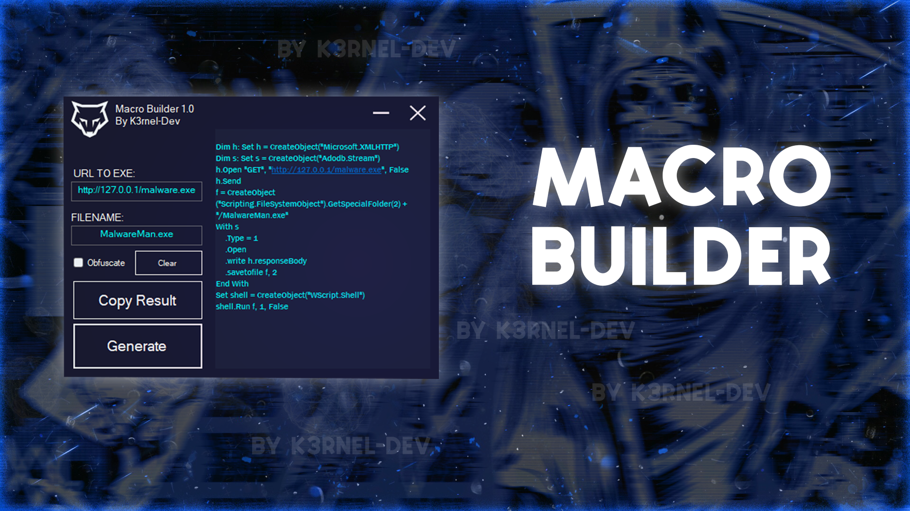

# 💉 <b> MacroBuilder v1.0</b> 

<!-- >   </img>  -->

>

### > **[⬇️ Download for Windows](https://github.com/K3rnel-Dev/MacroBuilder/releases/download/Build/MacroBuilder.exe)**   -->

# 📕 Small-About

> **A simple example** of macro builder for loading remote file to the target computer.

## ⚠️ **Disclaimer**: 
```
This project is for educational purposes only, intended for studying malware and security techniques. The author is not responsible for any malicious use of this software.
```

<br>

# ⭐ Credits 

- **Author**: <a href="https://github.com/k3rnel-dev">@K3rnel-Dev</a>
---
